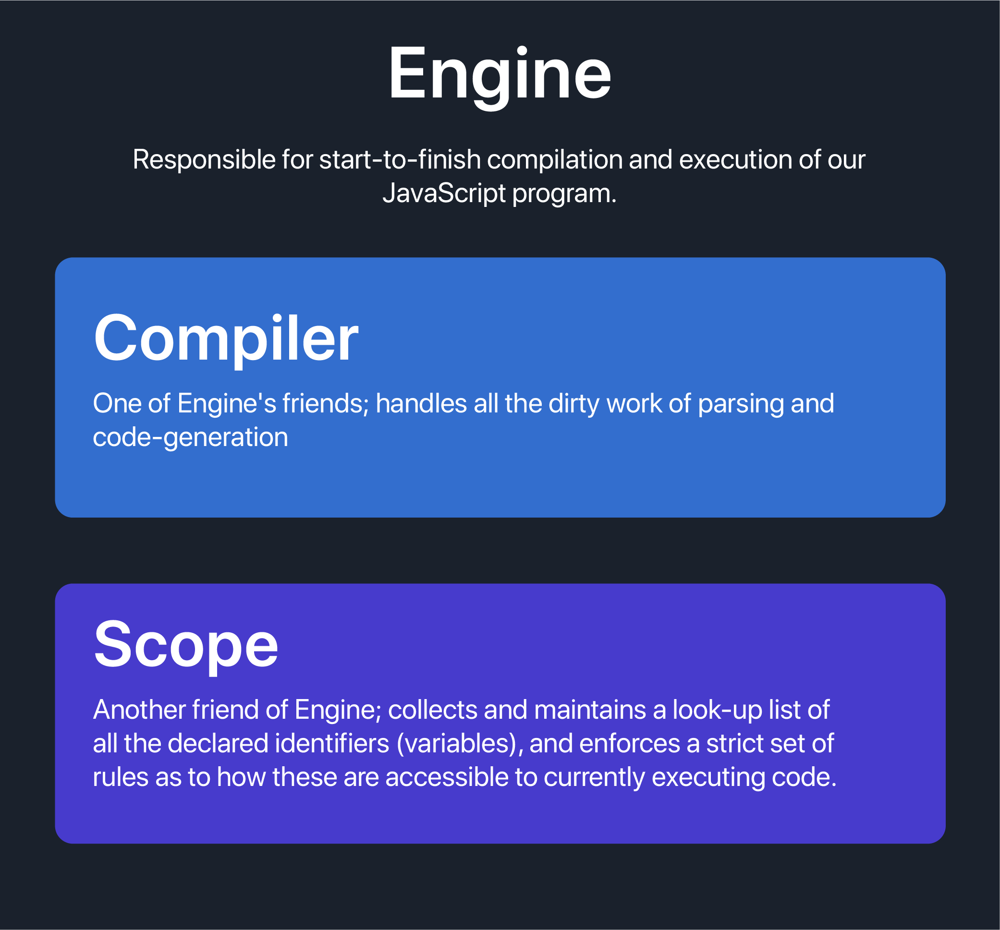

# Chapter 1: What is Scope?

The ability to store values and pull values out of variables is what gives a program *state*.

## Compilation Process
1. **Tokenizing/Lexing:** Breaking up a string of characters into meaningful chunks, called tokens. For instance, `var a = 2;`. would likely be broken up into the following tokens: `var`, `a`, `=`, `2`, and `;`. 
    
    * **Tokenizer vs Lexers:** 
    A tokenizer breaks a stream of text into tokens, usually by looking for whitespace (tabs, spaces, new lines). Whereas, A lexer is basically a tokenizer, but it usually attaches extra context to the tokens -- this token is a number, that token is a string literal, this other token is an equality operator.

2. **Parsing:** The process that takes the stream of tokens from the lexer and turns it into an abstract syntax tree representing the (usually) program represented by the original text.

3. **Code-Generation:** The process of taking an AST and turning it into executable code. 

## Understanding Scope

### Key Components During Compilation

### LHS vs RHS Lookup
1. RHS lookup takes place when the compiler asks the scope for the value of a given variable. Example , `return b;` is an RHS reference.
2. LHS lookup on the other hand is used by the compiler to assign value to a given variable. Example, `a = 2;` is an LHS reference.

    